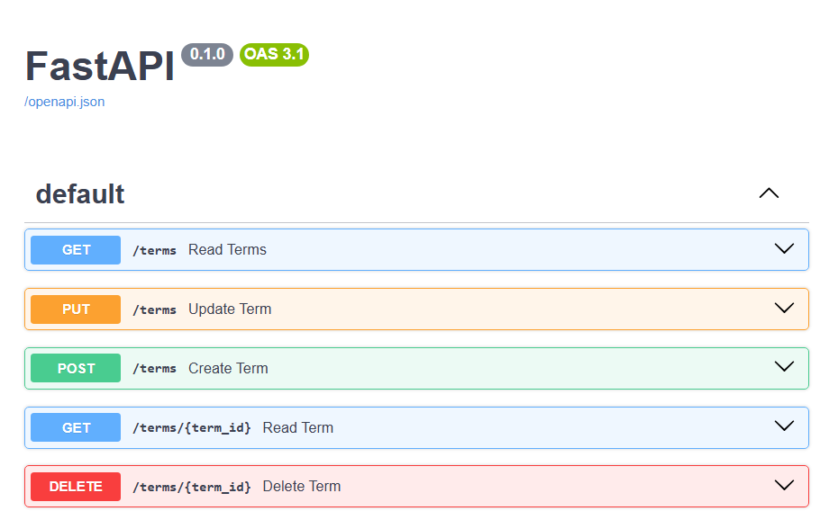
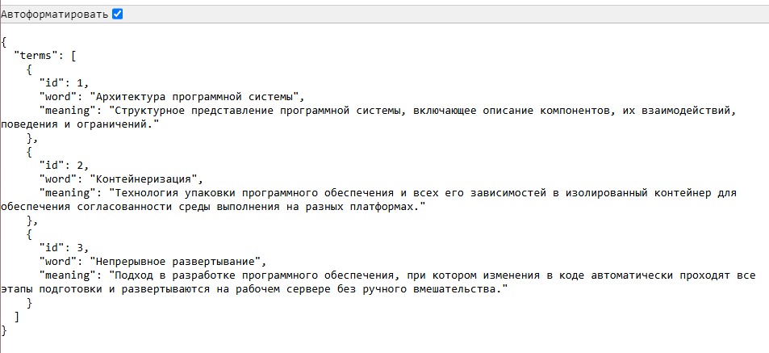
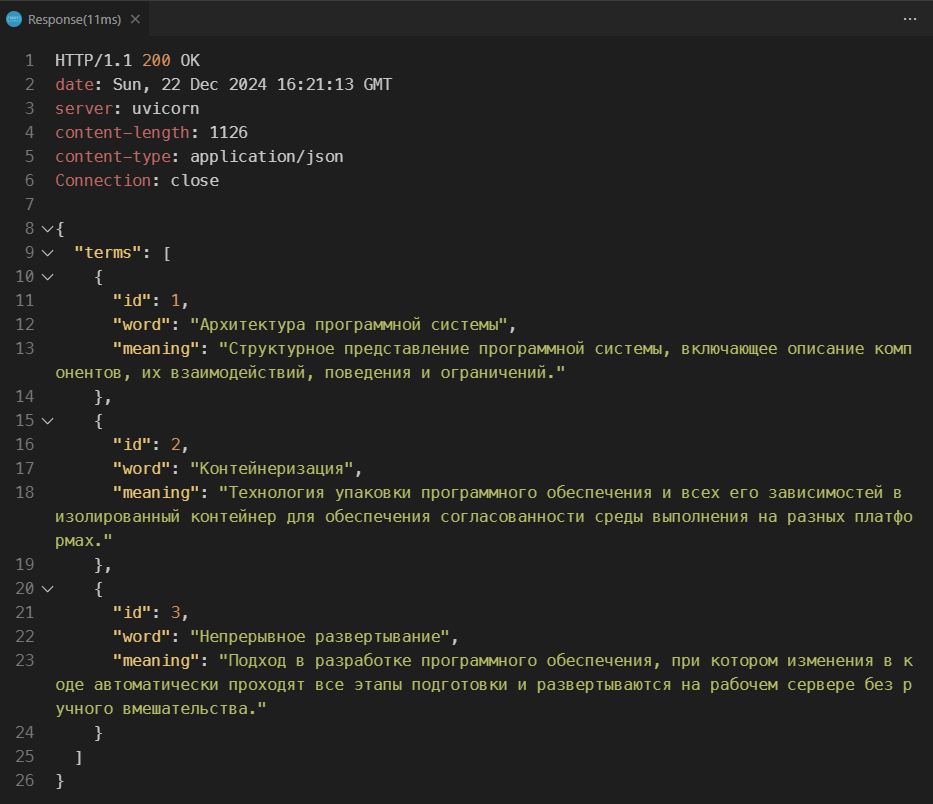

# docker-practice-8

Репозиторий для задания 8 курса "Проектирование и развертывание веб-решений в экосистеме Python". Магистерская программа Веб-технологии, Университет ИТМО, 2024

В задании нужно при помощи фреймворка gRPC и протокола protobuf реализовать API для работы с глоссарием терминов для научной работы. Глоссарий должен поддерживать следующие операции:

- получение списка всех терминов,
- получение информации об одном термине,
- добавление нового термина,
- обновление существующего термина,
- удаление термина из глоссария.

## Инструкция по развертыванию приложения в Docker

Если приложение требуется запустить в виде Docker-контейнера, то сначала нужно также склонировать репозиторий при помощи команды:

```bash
git clone https://github.com/strawberrycheeks/docker-practice-8.git
```

Затем нужно перейти в созданную директорию при помощи команды:

```bash
cd docker-practice-8
```

В репозитории уже есть все необходимые файлы для запуска приложения. Для компиляции файлов protobuf (файлов с с расширением `.proto`) была использована команда:

```bash
python -m grpc_tools.protoc -I. --python_out=. --grpc_python_out=. glossary.proto
```

Собрать Docker-образ и запустить контейнер можно, используя команду:

```bash
docker-compose up --build
```

Документация API будет доступна по адресу: [http://localhost:8000/docs](http://localhost:8000/docs).



Список всех терминов будет доступен в формате JSON по адресу: [http://localhost:8000/terms](http://localhost:8000/terms).



Примеры запросов содержатся в файле `requests.http`. Запросы можно отправить из Visual Studio Code, используя расширение [REST Client](https://marketplace.visualstudio.com/items?itemName=humao.rest-client).


